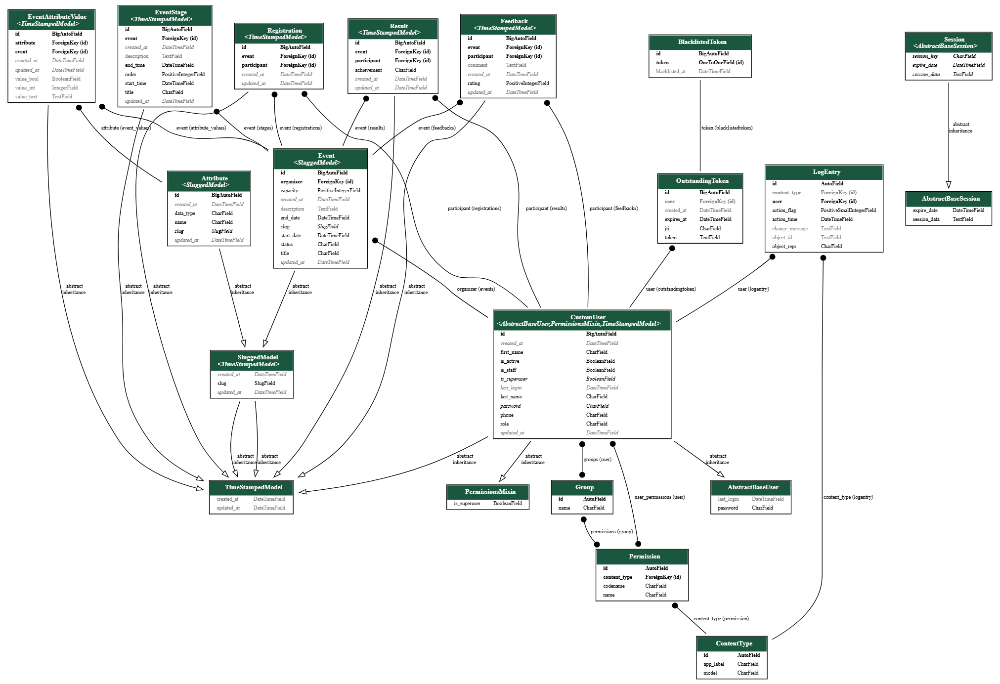

# Event Planet 🎉

An **API-first** event planning and management platform built with Django REST Framework. Organizers can create and manage multi-stage events, while Participants can browse published events, register, submit feedback, and view results.

---

## Table of Contents

- [Tech Stack](#tech-stack)
- [Architecture Decisions](#architecture-decisions)
- [Project Structure](#project-structure)
- [Database Schema (ERD)](#database-schema-erd)
- [Running with Docker](#running-with-docker)
- [Environment Variables](#environment-variables)
- [Creating a Superuser](#creating-a-superuser)
- [API Documentation](#api-documentation)
- [API Groups](#api-groups)
- [UI](#ui)

---

## Tech Stack

| Tool | Version |
|---|---|
| Python / Django | 6.0.3 |
| Django REST Framework | 3.17.1 |
| djangorestframework-simplejwt | 5.5.1 |
| PostgreSQL (production) | 15 |
| drf-spectacular (OpenAPI / Swagger) | 0.29.0 |
| Docker / Docker Compose | — |

---

## Architecture Decisions

The task description left several design decisions up to the implementer. Here are the final decisions made in this project and the reasoning behind each:

### 1. Registration & Capacity: Event-level, not Stage-level

Participant registration (`Registration`) and capacity enforcement (`capacity`) are handled at the **whole-Event level**, not per individual `EventStage`.

**Why?** Most of the scenario examples (multi-part webinars, multi-session workshops) describe events where a participant registers once for the entire event and attends all of its stages. Per-stage registration would have added unnecessary complexity to the data model without a clear benefit for this project's scope. `EventStage` is purely a scheduling/content unit within an event, not an independent registration unit.

### 2. Dynamic Attributes (EAV)

To support variable, per-event-type attributes (without `JSONField` and without adding a new column for every attribute), an **EAV (Entity-Attribute-Value)** pattern is used with two models:

- **`Attribute`**: The global, independent definition of an attribute (e.g. "number of rounds", "difficulty level") along with its `data_type` (`TEXT` / `INTEGER` / `BOOLEAN`). This definition is shared across multiple events and is managed only by admins/staff, since it's a global catalog rather than something owned by a single event.
- **`EventAttributeValue`**: The actual value of a given `Attribute` for a specific `Event`, stored in one of three type-specific columns (`value_text`, `value_int`, `value_bool`) so the value stays **type-safe**. Only one of these three columns is populated, depending on the attribute's `data_type` — this rule is enforced both in the model's `clean()` (for the Django admin) and in the serializer (for the API). Managing these values is restricted to the Organizer who owns the event.

### 3. Event Status Lifecycle (State Machine)

`Event.status` is a state machine with well-defined allowed transitions:

```
DRAFT → PUBLISHED, CANCELLED
PUBLISHED → ONGOING, CLOSED, CANCELLED
ONGOING → FINISHED, CANCELLED
CLOSED → FINISHED, CANCELLED
FINISHED → (terminal)
CANCELLED → (terminal)
```

These rules live in `ALLOWED_TRANSITIONS` on the `Event` model itself, acting as a **single source of truth**, and are enforced in two separate places:
- `Event.clean()` → for requests coming from the **Django admin panel** (since the admin's `ModelForm` automatically calls `full_clean()`).
- `EventSerializer.validate()` → for requests coming through the **API** (since DRF does not call the model's `clean()` by default).

The same pattern (shared logic on the model + separate enforcement in admin and API) is also applied to `EventStage` time-range and overlap validation.

### 4. Separate Settings for Development and Production

- **`config/settings/dev.py`**: uses **SQLite** — for fast, local development without needing to spin up Postgres.
- **`config/settings/prod.py`**: uses **PostgreSQL**, and is exactly what Docker Compose runs against — matching the task requirement that "the platform must be fully implemented with PostgreSQL."

The choice between the two is controlled by the `DJNAGO_ENV` environment variable (`dev` or `prod`) in `config/settings/__init__.py`.

### 5. Authentication: JWT

Instead of session-based auth, `djangorestframework-simplejwt` is used (per the "token-based authentication" requirement). A token is obtained via `POST /api/<version>/user/api/token/` and must be sent on every protected request as `Authorization: Bearer <token>`.

---

## Project Structure

```
event_planet/
├── config/                  # Project settings (settings, urls, wsgi/asgi)
│   └── settings/
│       ├── base.py          # Shared settings
│       ├── dev.py           # SQLite — local development
│       └── prod.py          # PostgreSQL — Docker / production
├── core/                    # Base models (TimeStampedModel, SluggedModel) and shared permissions
├── user/                    # Users, roles (Organizer/Participant), JWT authentication
├── event/                   # Event, EventStage, and the status lifecycle
├── attribute/                # Attribute and EventAttributeValue (EAV design)
├── relation/                 # Registration, Feedback, Result
├── Dockerfile
├── docker-compose.yml
├── docker-entrypoint.sh
├── requirements.txt
└── .env
```

---

## Database Schema (ERD)

An entity-relationship diagram of the project's models was generated using [`django-extensions`](https://django-extensions.readthedocs.io/) (the `graph_models` command) and lives under `docs/`:



The raw Graphviz DOT file (editable / re-renderable with any DOT-compatible tool) is also available at [`docs/models.dot`](docs/models.dot).

### Core models at a glance

| Model | Description |
|---|---|
| `CustomUser` | The project's custom user model (`AbstractBaseUser` + `PermissionsMixin`), using `phone` as the login identifier and a `role` field to distinguish Organizer/Participant |
| `Event` | The main event entity; owned by an `organizer`, has a `status` state machine and a time range |
| `EventStage` | A stage of a multi-stage event, each with its own `order` and independent time range, belonging to one `Event` |
| `Attribute` | The global, event-independent definition of a dynamic attribute (EAV design) |
| `EventAttributeValue` | The actual value of a given `Attribute` for a specific `Event` (stored in type-safe columns: `value_text`, `value_int`, `value_bool`) |
| `Registration` | A `participant`'s registration for an `event` |
| `Feedback` | Feedback submitted by a participant for an event they registered for |
| `Result` | A participant's result for a finished event, published by the organizer |

The remaining models in the diagram (`OutstandingToken`, `BlacklistedToken`, `LogEntry`, `Session`, `Group`, `Permission`, `ContentType`, and the abstract `TimeStampedModel`/`SluggedModel`/`AbstractBaseUser`/`PermissionsMixin`) belong to Django's core, Simple JWT, and the admin app infrastructure — they are not part of the project's own business logic.

### Regenerating the diagram

If you change the models and want to regenerate the diagram:

```bash
docker-compose exec web python manage.py graph_models -a -g -o docs/graphviz.png
```

(`-g` groups models by app; `-a` includes all installed apps, not just this project's own apps.)

---

## Running with Docker

### Prerequisites
Docker and Docker Compose installed.

### Steps

1. Create a `.env` file in the project root (see [Environment Variables](#environment-variables) below for the full list).

2. Bring the project up with a single command:

```bash
docker-compose up --build
```

This command:
- Starts the `db` service (PostgreSQL 15) with a `healthcheck`.
- Makes the `web` service (Django) wait until `db` is actually ready (`depends_on: condition: service_healthy`).
- Runs `docker-entrypoint.sh`, which automatically applies `python manage.py migrate` and then starts the server on `0.0.0.0:8000`.

3. The project is now available at:
```
http://localhost:8000/
```

To stop:
```bash
docker-compose down
```
(To also wipe the database volume: `docker-compose down -v`)

---

## Environment Variables

Create a `.env` file in the project root with the following keys (an unfilled template is provided in `.env.example`):

| Variable | Description | Example |
|---|---|---|
| `DJNAGO_ENV` | Determines which settings module is loaded (`dev` or `prod`) | `prod` |
| `SECRET_KEY` | Django's security key — must be a random, secret value in production | `django-insecure-...` |
| `DEBUG` | Django debug mode — **must be `False` in production/Docker** | `False` |
| `ALLOWED_HOSTS` | Comma-separated list of allowed hosts | `127.0.0.1,localhost,web` |
| `DB_NAME` | PostgreSQL database name | `event_planet` |
| `DB_USERNAME` | Database username | `postgres` |
| `DB_PASSWORD` | Database password | `pass` |
| `DB_HOST` | Database host — inside Docker this must be the service name (`db`) | `db` |
| `DB_PORT` | Database port | `5432` |

⚠️ None of these values (especially `SECRET_KEY` and `DB_PASSWORD`) are hardcoded anywhere in the codebase or Dockerfile — everything is read from `.env`.

---

## Creating a Superuser

After bringing the containers up with `docker-compose up`, in a new terminal run:

```bash
docker-compose exec web python manage.py createsuperuser
```

Follow the prompts to enter a phone number, first/last name, and password. You can then log in to the Django admin at `http://localhost:8000/admin/`.

---

## API Documentation

Interactive API documentation (Swagger / Redoc) is generated automatically by `drf-spectacular`:

| Path | Description |
|---|---|
| `/api/schema/` | Raw OpenAPI schema |
| `/api/schema/swagger-ui/` | Interactive Swagger UI |
| `/api/schema/redoc/` | Redoc documentation |

All endpoints are versioned and must be called with an `/api/v1/` or `/api/v2/` prefix (`URLPathVersioning`).

---

## API Groups

### 🌍 Public APIs (no authentication required)
- `GET /api/v1/event/` — list published (`PUBLISHED`) events
- `GET /api/v1/event/{id}/` — details of a published event
- `GET /api/v1/result/` — published results of finished events

### 🙋 Participant APIs (requires a Token + Participant role)
- `POST /api/v1/registration/` — register for a `PUBLISHED` event
- `GET /api/v1/registration/` — view the current user's own registrations
- `POST /api/v1/feedback/` — submit feedback (only for `FINISHED` events the user registered for)

### 🗂️ Organizer APIs (requires a Token + Organizer role)
- `POST /api/v1/event/` — create a new event (always starts as `DRAFT`)
- `PATCH/PUT /api/v1/event/{id}/` — edit an event (owner only) and transition its status per the state machine
- `POST/PATCH /api/v1/eventstage/` — manage an event's stages (own events only)
- `POST/PATCH /api/v1/eventattributevalue/` — manage dynamic attribute values (own events only)
- `GET /api/v1/event/{id}/participants/` — view the list of participants for one's own event
- `GET /api/v1/feedback/` — view feedback submitted for one's own events
- `POST /api/v1/result/` — publish results (only for one's own `FINISHED` events, and only for participants who actually registered)

### 🔐 Authentication
- `POST /api/v1/user/register/` — register a new user
- `POST /api/v1/user/api/token/` — obtain a JWT (access + refresh)
- `POST /api/token/refresh/` — refresh the access token

All role-based access rules are enforced both at the `permission_classes` level and, where DRF's built-in permission checks aren't sufficient on their own (e.g. on `create`), at the serializer validation level as well.

---

## UI

This project is **API-only**. Per the task description, a UI was optional, and no UI (no Django templates, no HTMX, no separate frontend) has been added in this version of the project. All interaction with the system should go through the endpoints documented above and/or the Swagger UI (`/api/schema/swagger-ui/`).

---

  <br>
  
  <br>
  <b>😎 New features and improvements are on the way! 
  😅😄😘</b>
</p>


Developed by [Ehsan Barghamadi](https://github.com/EhsanBarghamadi)